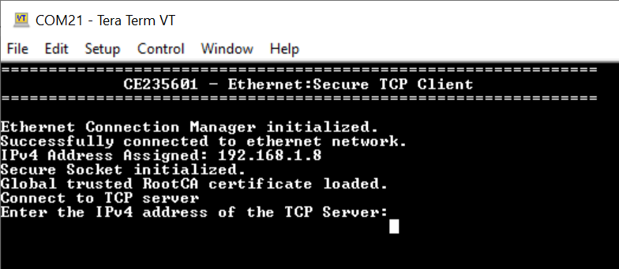
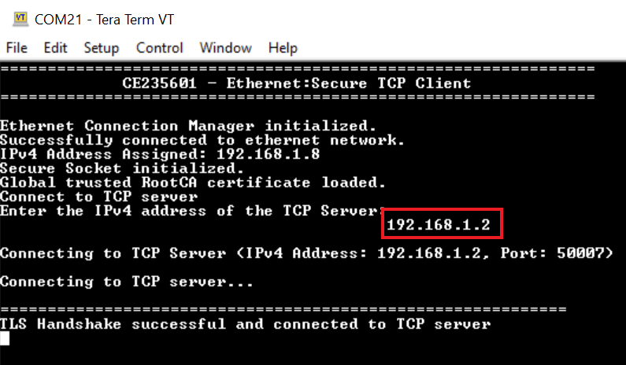
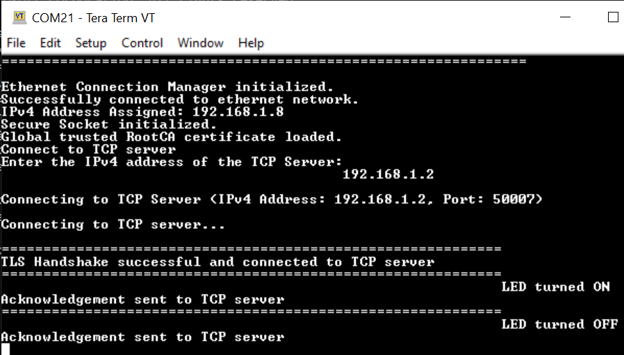
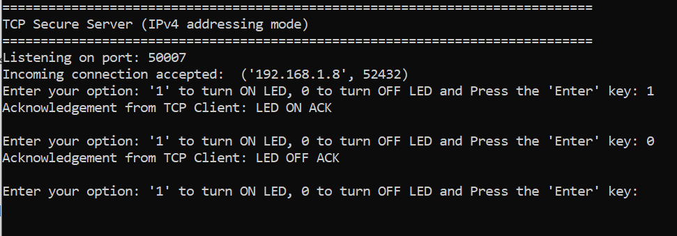

# Ethernet: Secure TCP Client

This code example demonstrates the implementation of a secure TCP client with XMC7000. 

In this example, a TCP client establishes a secure connection with a TCP server through an SSL handshake. After the SSL handshake completes successfully, the TCP client turns ON or OFF the user LED based on the command received from the TCP server. 

This example uses the Ethernet Core FreeRTOS lwIP mbedtls library of the SDK. This library enables application development based on Ethernet by bundling together various other libraries - FreeRTOS, lwIP TCP/IP stack, mbed TLS, and secure sockets. The secure sockets library provides an easy-to-use API by abstracting the network stack (lwIP) and the security stack (mbed TLS). 

[View this README on GitHub.](https://github.com/Infineon/mtb-example-ethernet-secure-tcp-client)

[Provide feedback on this code example.](https://cypress.co1.qualtrics.com/jfe/form/SV_1NTns53sK2yiljn?Q_EED=eyJVbmlxdWUgRG9jIElkIjoiQ0UyMzU2MDEiLCJTcGVjIE51bWJlciI6IjAwMi0zNTYwMSIsIkRvYyBUaXRsZSI6IkV0aGVybmV0OiBTZWN1cmUgVENQIENsaWVudCIsInJpZCI6Im5pZ3Vka2FyIiwiRG9jIHZlcnNpb24iOiIxLjAuMCIsIkRvYyBMYW5ndWFnZSI6IkVuZ2xpc2giLCJEb2MgRGl2aXNpb24iOiJNQ0QiLCJEb2MgQlUiOiJJQ1ciLCJEb2MgRmFtaWx5IjoiUFNPQyJ9)

## Requirements

- [ModusToolbox&trade; software](https://www.infineon.com/cms/en/design-support/tools/sdk/modustoolbox-software) v3.0 or later (tested with v3.0)
- Programming language: C
- Associated parts: [XMC7000 MCU](https://www.infineon.com/cms/en/product/microcontroller/32-bit-industrial-microcontroller-based-on-arm-cortex-m/)


## Supported toolchains (make variable 'TOOLCHAIN')

- GNU Arm® embedded compiler v10.3.1 (`GCC_ARM`) - Default value of `TOOLCHAIN`
- Arm&reg; compiler v6.16 (`ARM`)
- IAR C/C++ compiler v9.30.1 (`IAR`)

## Supported kits (make variable 'TARGET')

- [XMC7200 evaluation kit](https://www.infineon.com/KIT_XMC72_EVK) (`KIT_XMC72_EVK`)


## Hardware setup

This example uses the board's default configuration. See the kit user guide to ensure that the board is configured correctly.


## Software setup

Install a terminal emulator if you don't have one. Instructions in this document use [Tera Term](https://ttssh2.osdn.jp/index.html.en).

Install a Python interpreter if you do not have one. This code example is tested with [Python 3.7.7](https://www.python.org/downloads/release/python-377/) and it is recommended to use a python 3 version.


## Using the code example

Create the project and open it using one of the following:

<details><summary><b>In Eclipse IDE for ModusToolbox&trade; software</b></summary>

1. Click the **New Application** link in the **Quick Panel** (or, use **File** > **New** > **ModusToolbox Application**). This launches the [Project Creator](https://www.infineon.com/ModusToolboxProjectCreator) tool.

2. Pick a kit supported by the code example from the list shown in the **Project Creator - Choose Board Support Package (BSP)** dialog.

   When you select a supported kit, the example is reconfigured automatically to work with the kit. To work with a different supported kit later, use the [Library Manager](https://www.infineon.com/ModusToolboxLibraryManager) to choose the BSP for the supported kit. You can use the Library Manager to select or update the BSP and firmware libraries used in this application. To access the Library Manager, click the link from the **Quick Panel**.

   You can also just start the application creation process again and select a different kit.

   If you want to use the application for a kit not listed here, you may need to update the source files. If the kit does not have the required resources, the application may not work.

3. In the **Project Creator - Select Application** dialog, choose the example by enabling the checkbox.

4. (Optional) Change the suggested **New Application Name**.

5. The **Application(s) Root Path** defaults to the Eclipse workspace which is usually the desired location for the application. If you want to store the application in a different location, you can change the *Application(s) Root Path* value. Applications that share libraries should be in the same root path.

6. Click **Create** to complete the application creation process.

For more details, see the [Eclipse IDE for ModusToolbox&trade; software user guide](https://www.infineon.com/MTBEclipseIDEUserGuide) (locally available at *{ModusToolbox&trade; software install directory}/ide_{version}/docs/mtb_ide_user_guide.pdf*).

</details>

<details><summary><b>In command-line interface (CLI)</b></summary>

ModusToolbox&trade; software provides the Project Creator as both a GUI tool and the command line tool, "project-creator-cli". The CLI tool can be used to create applications from a CLI terminal or from within batch files or shell scripts. This tool is available in the *{ModusToolbox&trade; software install directory}/tools_{version}/project-creator/* directory.

Use a CLI terminal to invoke the "project-creator-cli" tool. On Windows, use the command line "modus-shell" program provided in the ModusToolbox&trade; software installation instead of a standard Windows command-line application. This shell provides access to all ModusToolbox&trade; software tools. You can access it by typing `modus-shell` in the search box in the Windows menu. In Linux and macOS, you can use any terminal application.

This tool has the following arguments:

Argument | Description | Required/optional
---------|-------------|-----------
`--board-id` | Defined in the `<id>` field of the [BSP](https://github.com/Infineon?q=bsp-manifest&type=&language=&sort=) manifest | Required
`--app-id`   | Defined in the `<id>` field of the [CE](https://github.com/Infineon?q=ce-manifest&type=&language=&sort=) manifest | Required
`--target-dir`| Specify the directory in which the application is to be created if you prefer not to use the default current working directory | Optional
`--user-app-name`| Specify the name of the application if you prefer to have a name other than the example's default name | Optional

<br>

The following example will clone the "[Ethernet: Secure TCP Client](https://github.com/Infineon/mtb-example-ethernet-secure-tcp-client)" application with the desired name "MySecureTCPClient" configured for the *KIT_XMC72_EVK* BSP into the specified working directory, *C:/mtb_projects*:

   ```
   project-creator-cli --board-id KIT_XMC72_EVK --app-id mtb-example-ethernet-secure-tcp-client --user-app-name MySecureTCPClient --target-dir "C:/mtb_projects"
   ```

**Note:** The project-creator-cli tool uses the `git clone` and `make getlibs` commands to fetch the repository and import the required libraries. For details, see the "Project creator tools" section of the [ModusToolbox&trade; software user guide](https://www.infineon.com/ModusToolboxUserGuide) (locally available at *{ModusToolbox&trade; software install directory}/docs_{version}/mtb_user_guide.pdf*).

</details>

<details><summary><b>In third-party IDEs</b></summary>

Use one of the following options:

- **Use the standalone [Project Creator](https://www.infineon.com/ModusToolboxProjectCreator) tool:**

   1. Launch Project Creator from the Windows Start menu or from *{ModusToolbox&trade; software install directory}/tools_{version}/project-creator/project-creator.exe*.

   2. In the initial **Choose Board Support Package** screen, select the BSP, and click **Next**.

   3. In the **Select Application** screen, select the appropriate IDE from the **Target IDE** drop-down menu.

   4. Click **Create** and follow the instructions printed in the bottom pane to import or open the exported project in the respective IDE.

<br>

- **Use command-line interface (CLI):**

   1. Follow the instructions from the **In command-line interface (CLI)** section to create the application, and then import the libraries using the `make getlibs` command.

   2. Export the application to a supported IDE using the `make <ide>` command.

   3. Follow the instructions displayed in the terminal to create or import the application as an IDE project.

For a list of supported IDEs and more details, see the "Exporting to IDEs" section of the [ModusToolbox&trade; software user guide](https://www.infineon.com/ModusToolboxUserGuide) (locally available at *{ModusToolbox&trade; software install directory}/docs_{version}/mtb_user_guide.pdf*).

</details>


## Operation

1. Connect the board to your PC using the provided USB cable through the KitProg3 USB connector.

2. Connect one LAN cable from the target board(client) to the router and another LAN cable from your PC(server) to the router.

3. Open a terminal program and select the KitProg3 COM port. Set the serial port parameters to 8N1 and 115200 baud.

4. Open a command shell from the project directory and run the Python TCP secure server (*{project directory}\python-secure-tcp-server*) by typing in the following command:

     ```
     python tcp_secure_server.py
     ```

     On Linux and MacOS, check for the IPv4 address of ethernet connection in the network settings under System settings. For example, if the IPv4 address of the Linux or MacOS is found to be 192.168.1.2, then replace the following line of code in the _tcp_secure_server.py_ python script with the IPv4 address as shown before running the script.

   Replace 
   ```
   host = ''       # Symbolic name meaning the local host 
   ```
   with
   ```
   host = '192.168.1.2'       # Symbolic name meaning the local host 
   ``` 

     **Note:** Ensure that the firewall settings of your computer allow access to the Python software so as to allow communication with the TCP client. See this [community thread](https://community.infineon.com/t5/ModusToolbox-General/CE229112-Enable-Python-access-to-your-WiFi/td-p/214654).

5. Change the `TCP_SERVER_IP_ADDRESS` and `TCP_SERVER_PORT` macros defined in the *secure_tcp_client.h* file to match with the computer's(server) IP address and port number. For example, if your computer's IP address is
   192.168.1.2 and port number is 50007, update the macros as shown below:

   ```
   #define TCP_SERVER_IP_ADDRESS    MAKE_IPV4_ADDRESS(192, 168, 1, 2)
   #define TCP_SERVER_PORT          (50007u)
   ```

6. Program the board using one of the following:

   <details><summary><b>Using Eclipse IDE for ModusToolbox&trade; software</b></summary>

      1. Select the application project in the Project Explorer.

      2. In the **Quick Panel**, scroll down, and click **\<Application Name> Program (KitProg3_MiniProg4)**.
   </details>

   <details><summary><b>Using CLI</b></summary>

     From the terminal, execute the `make program` command to build and program the application using the default toolchain to the default target. The default toolchain and target are specified in the application's Makefile but you can override those values manually:
      ```
      make program TARGET=<BSP> TOOLCHAIN=<toolchain>
      ```

      Example:
      ```
      make program TARGET=KIT_XMC72_EVK TOOLCHAIN=GCC_ARM
      ```
   </details>

7. Determine the PC's(server) IP address.

   To determine the IP address, enter the following command in the command shell based on your operating system:

   Windows: `ipconfig`

   Linux: `curl ifconfig.me`

   macOS: `ifconfig |grep inet`


8. In the terminal program, enter the server IP address determined in Step 7.

  **Figure 1. Secure TCP client before ethernet connection**
  
  
  
   <br>
  
  **Figure 2. Secure TCP client after ethernet connection**
  
  

9. From the Python secure TCP server, send the command to turn the LED ON or OFF to the TCP client ('0' to turn the LED OFF and '1' to turn the LED ON). Observe the user LED (CYBSP_USER_LED) turning ON/OFF on the board.

  **Figure 3. Secure TCP client output**

  

  <br>

  **Figure 4. Secure TCP server output**
  
  
  

**Note:** 
- The code example has been tested in a local LAN setup and in a simple private network such as a home network with VPN disabled. To test it in a complex network such as an enterprise network, please contact your IT department.
- Check whether the port used for communication on your PC is an active port or not. If not, then you will have to open the firewall port. To display all the blocked and active ports configured in the firewall on PC, open command prompt(cmd for Windows) and enter the following command. 
```
netsh firewall show state
```


## Debugging

You can debug the example to step through the code. In the IDE, use the **\<Application Name> Debug (KitProg3_MiniProg4)** configuration in the **Quick Panel**. For details, see the "Program and debug" section in the [Eclipse IDE for ModusToolbox&trade; software user guide](https://www.infineon.com/MTBEclipseIDEUserGuide).


## Design and implementation

This example executes an RTOS task: TCP client task. 
In this example, the TCP client establishes a secure connection with a TCP server through SSL handshake. During the SSL handshake, the client presents its SSL certificate (self-signed) for verification and also verifies the server's identity to which it is connecting. Once the SSL handshake completes successfully, the TCP client controls the user LED ON or OFF based on the command received from the TCP server. See [Creating a self-signed certificate](#Creating-a-self-signed-SSL-certificate) for more details.

### Resources and settings

**Table 1. Application resources**

 Resource  |  Alias/object     |    Purpose
 :-------  | :------------     | :------------
 GPIO (HAL)| CYBSP_USER_LED    | User LED

<br />

### Creating a self-signed SSL certificate

The TCP client demonstrated in this example uses a self-signed SSL certificate. This requires **OpenSSL** which is already preloaded in the ModusToolbox&trade; software installation. Self-signed SSL certificate means that there is no third-party certificate issuing authority, commonly referred to as CA, involved in the authentication of the client. Servers connecting to this client must have an exact copy of the SSL certificate to verify the client's identity.

Follow the steps below to generate a self-signed SSL certificate:

#### Generate SSL certificate and private key

1. Run the following commands with a CLI (on Windows, use the command line "modus-shell" program provided in the ModusToolbox&trade; installation instead of a standard Windows command-line application) to generate the SSL certificate and private key.

   ```
   openssl req -new -newkey rsa:2048 -days 365 -nodes -x509 -keyout client.key -out client.crt
   ```

2. Follow the instructions in the command window to provide the details required for creating SSL certificate and private key.

The *client.crt* file is your client's certificate and *client.key* is your client's private key.


## Related resources

Resources | Links
-----------|------------------
Application notes | [AN234334](https://www.infineon.com/dgdl/Infineon-AN234334_Getting_started_with_XMC7000_MCU_on_ModusToolbox_software-ApplicationNotes-v01_00-EN.pdf?fileId=8ac78c8c8412f8d301842d32c5765bfd) – Getting started with XMC7000 MCU on ModusToolbox&trade; software 
Code examples  | [XMC7000 MCU examples](https://github.com/infineon?q=mtb-example%20XMC7000%20NOT%20Deprecated) on GitHub
Device documentation | [XMC7000 MCU datasheets](https://www.infineon.com/cms/en/product/microcontroller/32-bit-industrial-microcontroller-based-on-arm-cortex-m/) <br> [XMC7000 technical reference manuals](https://www.infineon.com/cms/en/product/microcontroller/32-bit-industrial-microcontroller-based-on-arm-cortex-m/) 
Development kits | [XMC&trade; eval boards](https://www.infineon.com/cms/en/product/microcontroller/32-bit-industrial-microcontroller-based-on-arm-cortex-m/#boards)
Libraries on GitHub | [mtb-pdl-cat1](https://github.com/Infineon/mtb-pdl-cat1) – Peripheral driver library (PDL) <br> [mtb-hal-cat1](https://github.com/Infineon/mtb-hal-cat1) – Hardware abstraction layer (HAL) library
Middleware on GitHub  | [mcu-middleware](https://github.com/Infineon/modustoolbox-software) – Links to all MCU middleware
Tools | [Eclipse IDE for ModusToolbox&trade; software](https://www.infineon.com/cms/en/design-support/tools/sdk/modustoolbox-software/) – ModusToolbox&trade; software is a collection of easy-to-use software and tools enabling rapid development with Infineon MCUs, covering applications from embedded sense and control to wireless and cloud-connected systems using AIROC&trade; Wi-Fi and Bluetooth® connectivity devices.

## Other resources


Infineon provides a wealth of data at www.infineon.com to help you select the right device, and quickly and effectively integrate it into your design.

For XMC&trade; MCU devices, see [32-bit XMC™ industrial microcontroller based on Arm® Cortex®-M](https://www.infineon.com/cms/en/product/microcontroller/32-bit-industrial-microcontroller-based-on-arm-cortex-m/).

## Document history

Document title: *CE235601* - *Ethernet: Secure TCP Client*

 Version | Description of change
 ------- | ---------------------
 1.0.0   | New code example

<br>

---------------------------------------------------------

© Cypress Semiconductor Corporation, 2022. This document is the property of Cypress Semiconductor Corporation, an Infineon Technologies company, and its affiliates ("Cypress").  This document, including any software or firmware included or referenced in this document ("Software"), is owned by Cypress under the intellectual property laws and treaties of the United States and other countries worldwide.  Cypress reserves all rights under such laws and treaties and does not, except as specifically stated in this paragraph, grant any license under its patents, copyrights, trademarks, or other intellectual property rights.  If the Software is not accompanied by a license agreement and you do not otherwise have a written agreement with Cypress governing the use of the Software, then Cypress hereby grants you a personal, non-exclusive, nontransferable license (without the right to sublicense) (1) under its copyright rights in the Software (a) for Software provided in source code form, to modify and reproduce the Software solely for use with Cypress hardware products, only internally within your organization, and (b) to distribute the Software in binary code form externally to end users (either directly or indirectly through resellers and distributors), solely for use on Cypress hardware product units, and (2) under those claims of Cypress’s patents that are infringed by the Software (as provided by Cypress, unmodified) to make, use, distribute, and import the Software solely for use with Cypress hardware products.  Any other use, reproduction, modification, translation, or compilation of the Software is prohibited.
<br />
TO THE EXTENT PERMITTED BY APPLICABLE LAW, CYPRESS MAKES NO WARRANTY OF ANY KIND, EXPRESS OR IMPLIED, WITH REGARD TO THIS DOCUMENT OR ANY SOFTWARE OR ACCOMPANYING HARDWARE, INCLUDING, BUT NOT LIMITED TO, THE IMPLIED WARRANTIES OF MERCHANTABILITY AND FITNESS FOR A PARTICULAR PURPOSE.  No computing device can be absolutely secure.  Therefore, despite security measures implemented in Cypress hardware or software products, Cypress shall have no liability arising out of any security breach, such as unauthorized access to or use of a Cypress product. CYPRESS DOES NOT REPRESENT, WARRANT, OR GUARANTEE THAT CYPRESS PRODUCTS, OR SYSTEMS CREATED USING CYPRESS PRODUCTS, WILL BE FREE FROM CORRUPTION, ATTACK, VIRUSES, INTERFERENCE, HACKING, DATA LOSS OR THEFT, OR OTHER SECURITY INTRUSION (collectively, "Security Breach").  Cypress disclaims any liability relating to any Security Breach, and you shall and hereby do release Cypress from any claim, damage, or other liability arising from any Security Breach.  In addition, the products described in these materials may contain design defects or errors known as errata which may cause the product to deviate from published specifications. To the extent permitted by applicable law, Cypress reserves the right to make changes to this document without further notice. Cypress does not assume any liability arising out of the application or use of any product or circuit described in this document. Any information provided in this document, including any sample design information or programming code, is provided only for reference purposes.  It is the responsibility of the user of this document to properly design, program, and test the functionality and safety of any application made of this information and any resulting product.  "High-Risk Device" means any device or system whose failure could cause personal injury, death, or property damage.  Examples of High-Risk Devices are weapons, nuclear installations, surgical implants, and other medical devices.  "Critical Component" means any component of a High-Risk Device whose failure to perform can be reasonably expected to cause, directly or indirectly, the failure of the High-Risk Device, or to affect its safety or effectiveness.  Cypress is not liable, in whole or in part, and you shall and hereby do release Cypress from any claim, damage, or other liability arising from any use of a Cypress product as a Critical Component in a High-Risk Device. You shall indemnify and hold Cypress, including its affiliates, and its directors, officers, employees, agents, distributors, and assigns harmless from and against all claims, costs, damages, and expenses, arising out of any claim, including claims for product liability, personal injury or death, or property damage arising from any use of a Cypress product as a Critical Component in a High-Risk Device. Cypress products are not intended or authorized for use as a Critical Component in any High-Risk Device except to the limited extent that (i) Cypress’s published data sheet for the product explicitly states Cypress has qualified the product for use in a specific High-Risk Device, or (ii) Cypress has given you advance written authorization to use the product as a Critical Component in the specific High-Risk Device and you have signed a separate indemnification agreement.
<br />
Cypress, the Cypress logo, and combinations thereof, WICED, ModusToolbox, PSoC, CapSense, EZ-USB, F-RAM, and Traveo are trademarks or registered trademarks of Cypress or a subsidiary of Cypress in the United States or in other countries. For a more complete list of Cypress trademarks, visit www.infineon.com. Other names and brands may be claimed as property of their respective owners.
